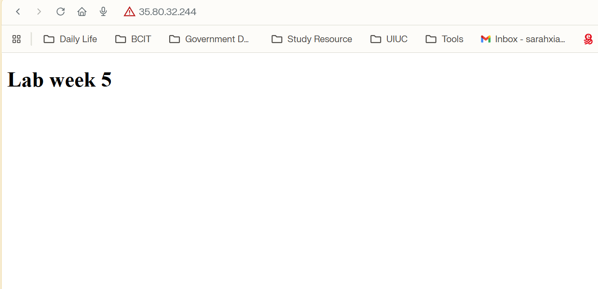

wk5-Packer-intro-lab-start

Starter files for the week 5 lab, intro to Packer.
See lab instructions on D2L for details.

# ACIT 4640 – In-Class Lab Week 5

## Packer AMI Build Result

Screenshot showing the Nginx web server (from my Packer-built AMI) serving the included HTML page:

